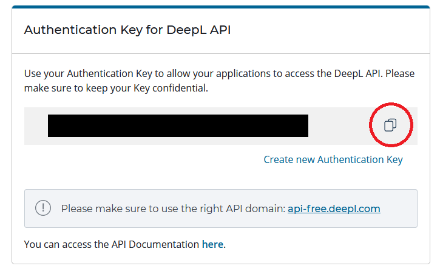
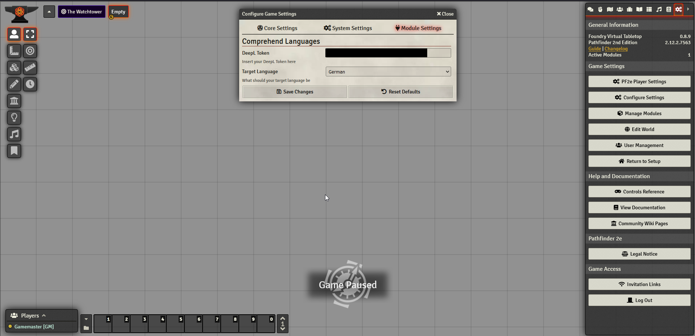
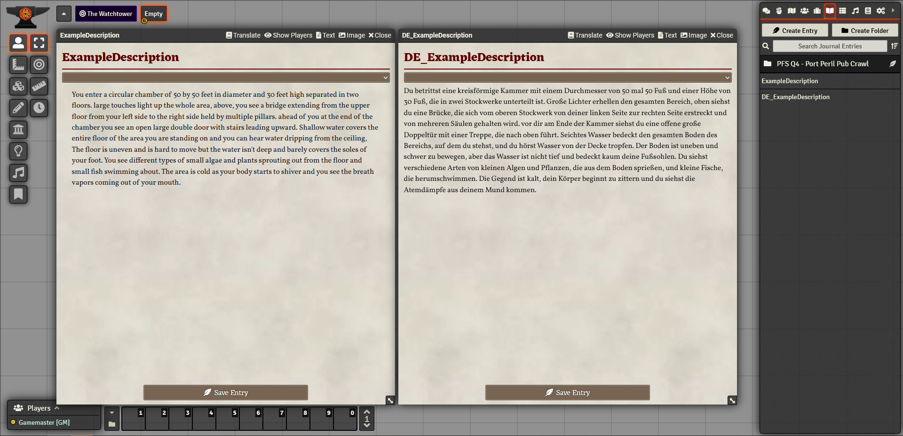

# What is Comprehend Languages

Comprehend languages leverages the Deepl API to automatically translate Foundry Journal Entries & (some) item descriptions from English into a language of your choice. In the process, a new journal entry is created that contains the translated text. The module was created specifically with [PDF to Foundry](https://gitlab.com/fryguy1013/pdftofoundry) in mind to help automatically translate adventure description text into the GM's native language.

# How does it work?

A bit of setup work is required before the module functions. You need to create a DeepL API Free account at [Deepl.com](https://www.deepl.com/pro#developer). The Free account should give you way more translated characters than you should need (500.000 characters/month). Unfortunately, a credit card (that will not be charged unless you upgrade to a Pro account) is required for the account creation process.
After setting up your account, go into your DeepL account settings and copy the "Authentication Key for DeepL API".

After enabling the module in your world, open the Module Settings and paste the API Key into the **DeepL Token** input field. Here you can also set your preferred target language.

Now you are good to go. When opening a Journal Entry or Item, a new button appears in the header only for the GM (**Translate**). Click on that button and after a few seconds (depending on the length of the text) a new JournalEntry or Item will be created which is called _xx_OldName_. XX is a two letter abbreviation for your target language. Optionally you can also enable a setting that saves all translated entries into their own folder.

The module retains HTML formatting.

If you find any issues, feel free to contact me directly or file an issue here on GitHub.

# Hotkey Translation of Selected Text

The module also lets you translate selected text via hotkey (default: Alt+T, configurable in the Controls section of Foundry). Simply select any text in a JournalEntry, Item description or even in the chat, press the hotkey and a Dialog with your translation will open shortly. These translations are not persisted. As soon as you close the Dialog, they are gone.
